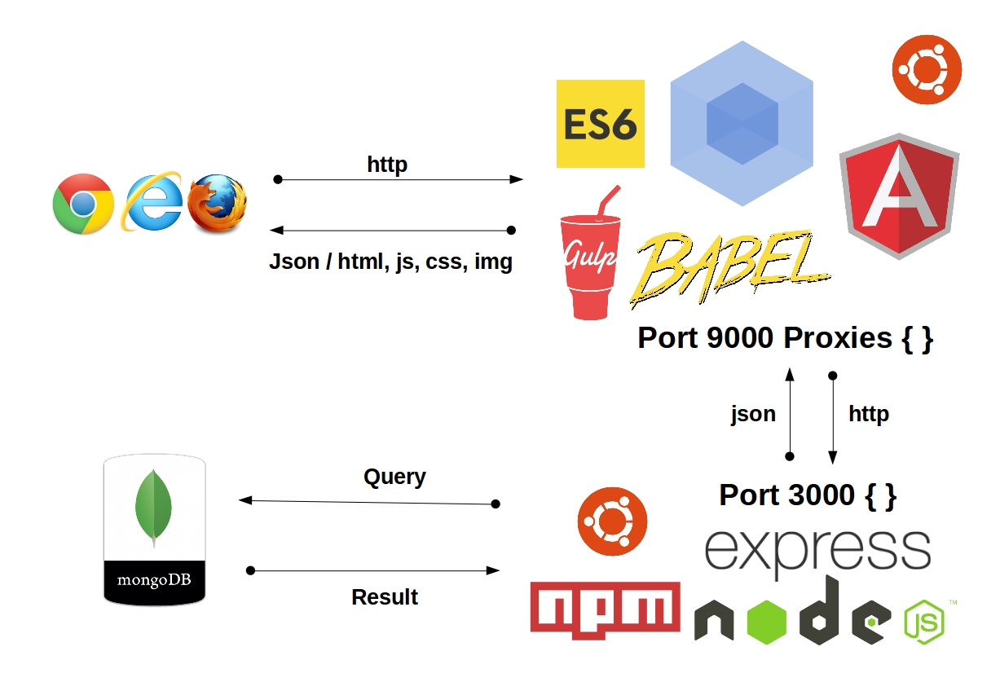

# Belajar-ES6

Merupakan project yang dibuat untuk belajar EcmaScript 6

#Development Stack



#Cara menjalankan pada komputer local

beri akses terlebih dahulu
```bash
chmod a+x install-local.sh
```
kemudian jalankan
```bash
./install-local.sh
```

#Cara menjalankan pada vagrant

untuk setup vagrant

```bash
vagrant up
```

untuk provisioning

```bash
vagrant provision
```

kemudian tambah kan host pada komputer local anda, buka host terlebih dahulu dengan perintah

```bash
sudo nano /etc/hosts
```

kemudian tambahkan

```bash
127.0.0.1       belajar.es6.com
```

akses pada browser di `http://belajar.es6.com:8080/`
